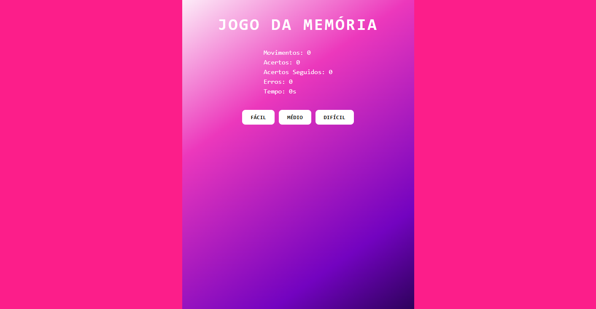
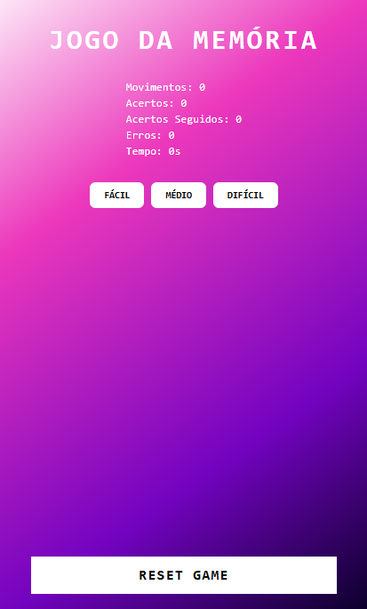
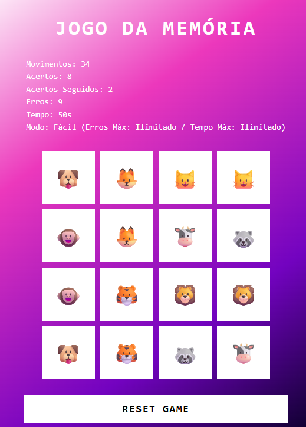

# Jogo da Memória com Emojis

[Link do site](https://gustavopereira-dev.github.io/Bootcamp_RiHappy_Front-end/jogo-memoria/)

Este projeto é uma releitura moderna e divertida do clássico jogo da memória, onde os pares a serem encontrados são representados por emojis em um tabuleiro interativo 4x4. A proposta é simples e cativante: desafiar a mente do jogador enquanto ele explora combinações visuais, lógica e estratégia.

## Mecânica do Jogo

- Formato do Tabuleiro: Uma grade 4x4 com 16 cartas viradas, onde cada emoji aparece exatamente duas vezes.
- Objetivo: Encontrar todos os pares combinando os emojis no menor tempo possível e com o menor número de erros.

### Sistema de Dificuldades
O jogo oferece três modos de desafio:

|Dificuldade | Erros Permitidos | Tempo Máximo    |
|------------|------------------|-----------------|
| Fácil      |  Não possuí      |  Não possuí     |  
| Médio      |  15 erros        |  90 segundos    |
| Difícil    |  8 erros         |  60 segundos    |

Cada modo determina os limites específicos de desempenho, tornando cada jogada única e estimulante.

### Estatísticas em Tempo Real
Durante e após a partida, o jogador pode acompanhar:

- Acertos totais
- Erros cometidos
- Sequência de acertos consecutivos
- Tempo decorrido
- Quantidade de movimentos
- Limites do modo selecionado

## Conclusão
Essas informações e os dados do jogo como um todo aumentam o engajamento, permitindo uma análise clara do desempenho e incentivando o jogador a melhorar a cada tentativa.