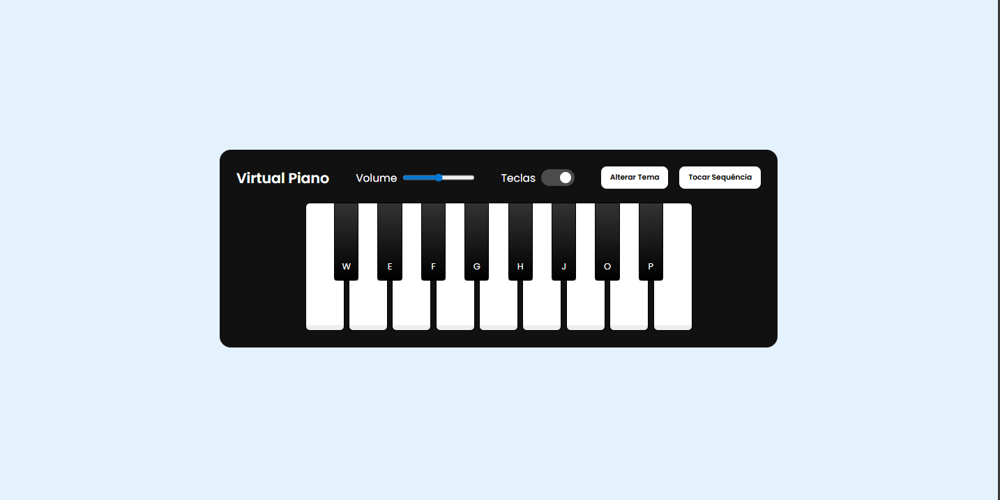
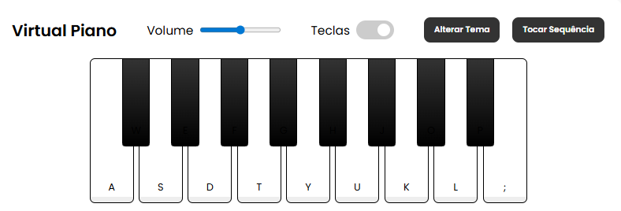
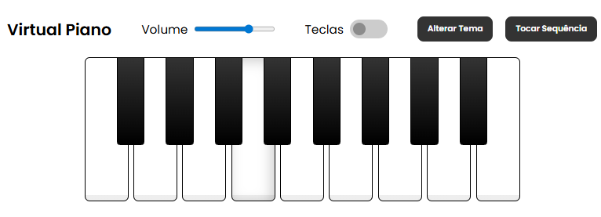

# Simulador de Piano Virtual

[Link do site](https://gustavopereira-dev.github.io/Bootcamp_RiHappy_Front-end/music-keyboard/)

É um piano digital acessível pelo navegador, onde qualquer pessoa pode tocar notas musicais clicando nas teclas ou usando o teclado do computador.

## Funcionalidades possíveis
- Tocar notas com o mouse ou teclado (teclas como A, S, D...)
- Ajustar o volume do som
- Mostrar ou esconder os nomes das teclas
- Mudar entre modo claro e escuro
- Reproduzir uma sequência aleatória de notas automaticamente

## Retornos e interações do piano
- Cada tecla está ligada a uma nota (ex: tecla “A” toca a nota C)
- Os sons são tocados através de arquivos .wav que simulam notas de piano real
- Você pode clicar nas teclas ou apertar no seu teclado para ouvir
- O botão “Tocar Sequência” toca várias notas em sequência de forma aleatória

Pelo uso de responsividade, o layout se ajusta para telas menores, com teclas mais compactas, além de possuir uma interface elegante com modo escuro por padrão, onde é possível ativar o modo claro clicando em “Alterar Tema” e todas as teclas têm seus efeitos visuais respectivos ao serem tocadas

