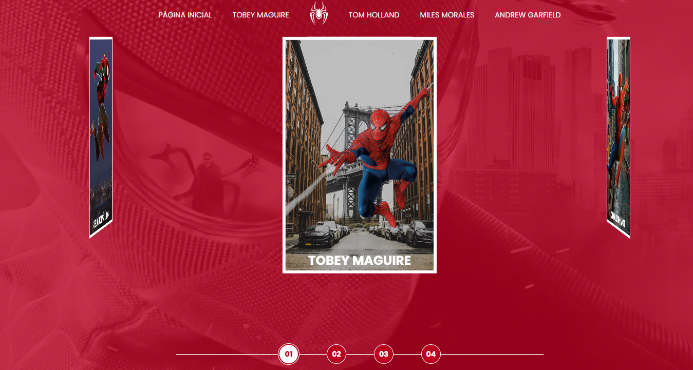
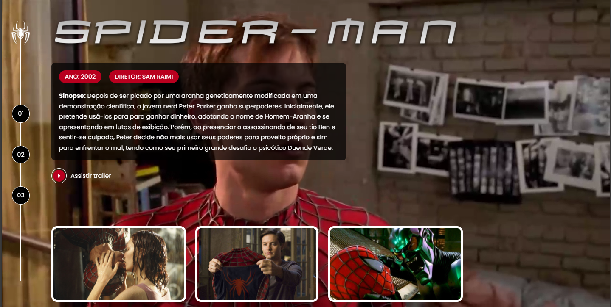
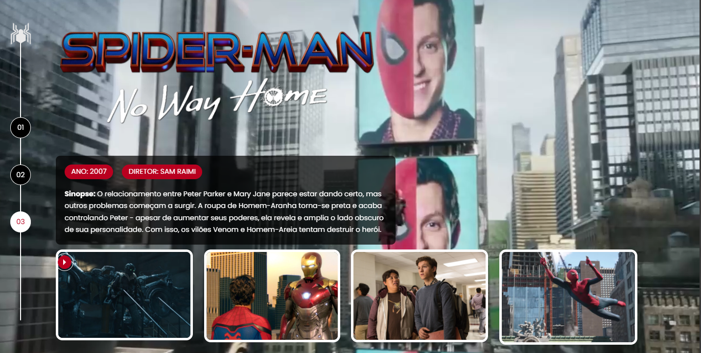
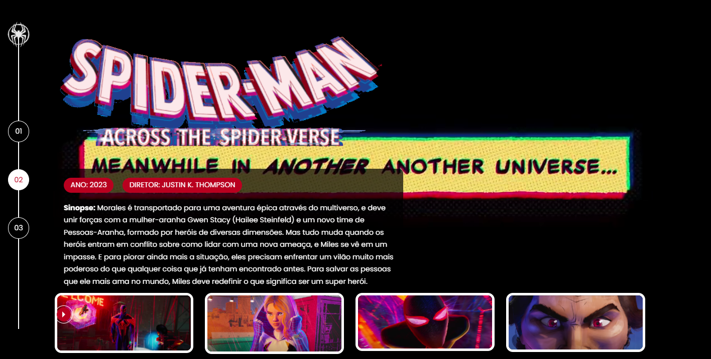
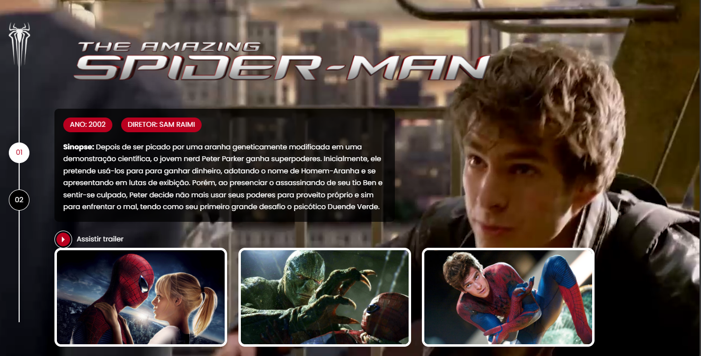
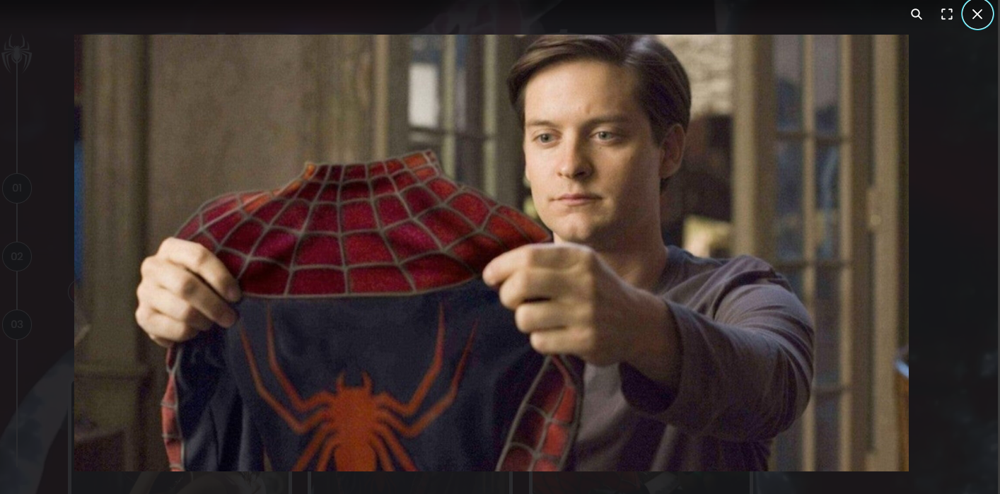
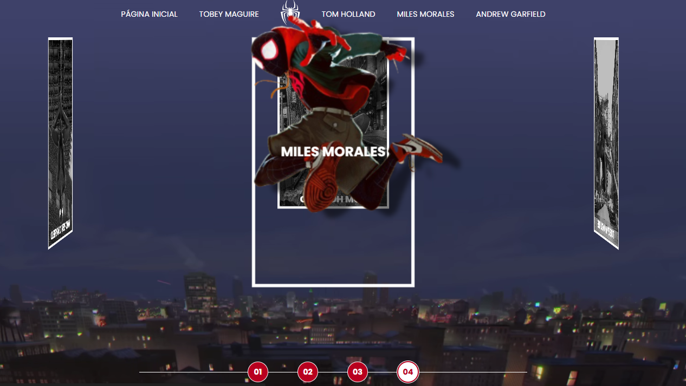

# Multiverso do Homem-Aranha

[Link do Site](https://gustavopereira-dev.github.io/Bootcamp_RiHappy_Front-end/spider-man-multiverses)

Uma galeria digital que permite explorar cada versão do personagem Spider-Man com imagens, sinopses e informações específicas. Ao clicar em um dos personagens, o visitante mergulha em uma página temática que simula a estética e o universo de cada versão.

## Recursos principais
- Carrossel interativo com os personagens:
  - Tobey Maguire (Trilogia Homem Aranha clássico)
  
  - Tom Holland (MCU - Universo Cinematográfico Marvel)
  
  - Miles Morales (Aranhaverso)

  - Andrew Garfield (Espetacular Homem Aranha)

- Páginas exclusivas por personagem com:
  - Trailer
  - Sinopse
  - Ficha técnica (Ano e Direção)
  - Galeria de imagens
  - Vídeo de fundo temático
- Efeitos visuais
  - Fundo vibrante, geralmente com tons fortes como vermelho ou preto — reforçando o clima heróico ou urbano
  - Destaque central para cada personagem com poses icônicas
  - Navegação intuitiva com seletores numéricos tanto na tela inicial quanto na específica para cada personagem, simulando transições de universo
  -  Paleta de cores e fontes ajustadas ao estilo de cada versão do Homem-Aranha
  - Navegação suave entre seções e universos

## Tecnologias usadas
- HTML – estrutura das páginas e conteúdo
- CSS – estilos visuais, animações, temas e responsividade
- JavaScript – lógica do carrossel, transições, interação com o usuário

## Experiência visual
- Cada personagem possui uma identidade visual própria, com imagens e cores únicas
- O layout se adapta a diferentes telas
- Animações suaves ao navegar entre cards ou páginas

