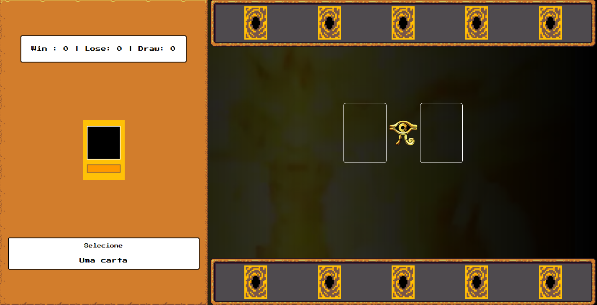
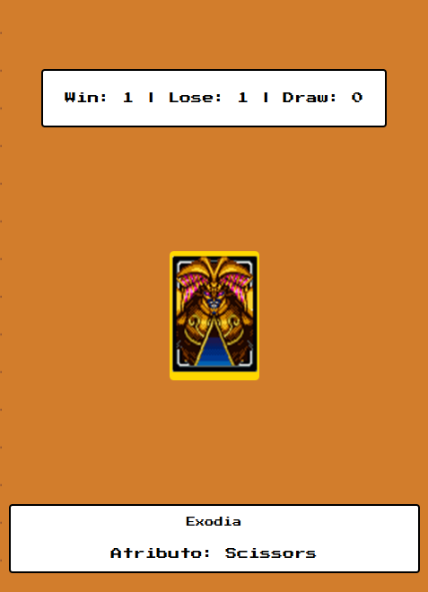
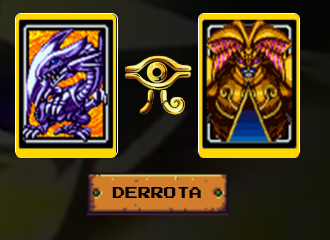

# Yu-Gi-Oh | Jo-ken-po Edition

[Link do Site](https://gustavopereira-dev.github.io/Bootcamp_RiHappy_Front-end/yu-gi-oh/)

Jogo de jokenpo que criei para explicar conceitos de lógica de programação aplicados a jogos

conceitos abordados:

- Armazenamento e gerenciamento de estado manual
- Funções limpas
- Organização de código

- Ao passar o mouse em uma das suas cartas (no canto inferior direito), é possível saber qual carta foi a selecionada junto com seus atributo (pedra, papel, tesoura)

- Clicando nessa mesma carta, é possível iniciar uma rodado do jokenpo com a sua carta, enquanto o computador escolhe uma outra aleatória, que pode fazer com que o resultado seja uma vitória, derrota ou empate (de acordo com o atributo de cada carta e da lógica geral de um jokenpo)

